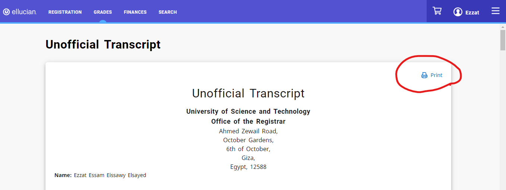
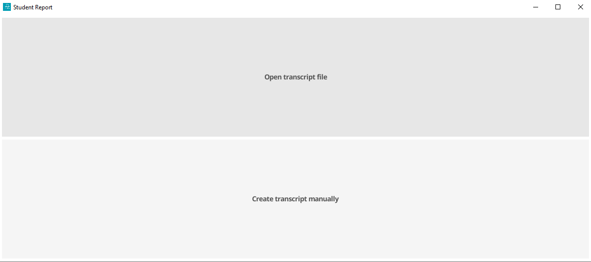
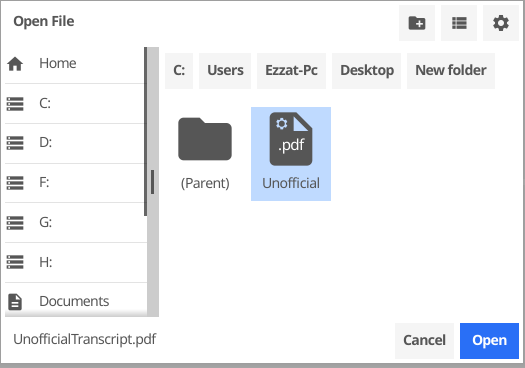
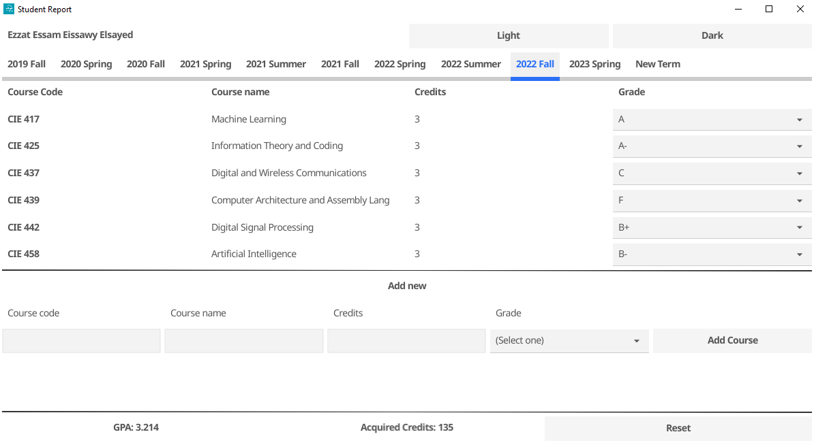

# ZC Transcript analyzer

## About
- This program can read your transcript pdf file and extract your grades
- This is useful if you want to test how will your GPA be affected if you changed the course grade or enrolled in new courses without having to manually enter all your data in a normal GPA calculator


## How to use the program
### 1- download your transcript from [zc website](https://sisselfservice.zewailcity.edu.eg/PowerCampusSelfService/Grades/UnofficialTranscript)

### 2- Open the executable and select Open transcript file

### 3- Browse and open the pdf file you downloaded

### 4- You can now view and modify your transcript and see the reflections on the gpa


## How to build manually
- If you don't have Fyne library installed 
```bash
 go install fyne.io/fyne/v2/cmd/fyne@latest
```
- Build the program 
```bash
 fyne install
```
## Or you can just download the latest release available (currently it's still in beta)
- [Windows build](https://github.com/EzzatEsam/Zc-Transcript-Analyzer/releases/tag/beta)


## License
This project is licensed under the MIT License - see the [LICENSE](LICENSE) file for details


